# Godot Shaders

> A fork of [gdquest-demos/godot-shaders](https://github.com/gdquest-demos/godot-shaders),
> maintained by **Señor Mega** and **Claude**, who knows nothing about Godot.

Upstream stalled part-way through its Godot 3 to 4 port and the demos stopped
working. This fork finishes it. All 39 demos and the intro presentation run.

The original project README is kept verbatim as
[README.LEGACY.md](README.LEGACY.md), including its links to GDQuest's courses
and channels.

## Requirements

Godot **4.4 or newer**. Imported mesh node names follow the 4.4 importer, which
writes `Cube_001` where earlier versions wrote `Cube001`. Developed against
4.7.1.

## Running the demos

Open the `godot/` directory as a project. The main scene,
`Main/DemoSelector.tscn`, is a browser that lists every demo and loads it in
place.

Each demo is also a standalone scene under `Demos/`, so any one of them can be
opened and run directly. Shaders live in `Shaders/`; a few demos keep their
shader next to the scene that uses it. `Intro/ShaderPipelineIntro.tscn` is a
separate presentation about the shader pipeline.

Checks that the demos still load and draw live in
[`godot/tests/`](godot/tests/README.md).

## The shaders

### 3D shaders

| | Demo | What it shows |
| --- | --- | --- |
| 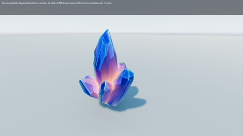 | **Crystals** `CrystalsDemo.tscn` | A SpatialMaterial converted to a shader, adding a TIME-based pulse to its emission and fresnel. |
| 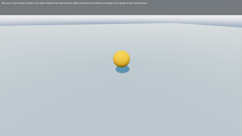 | **3D dissolve** `Dissolve3DDemo.tscn` | A noise mask dissolves a 3D object by reducing the mesh's alpha channel according to the shape of the noise texture. |
| 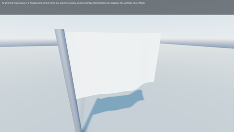 | **Waving flag** `Flag3DDemo.tscn` | The shader samples and scrolls OpenSimplexNoise to displace the mesh's vertices, giving the impression of a flag blowing in the wind. |
| 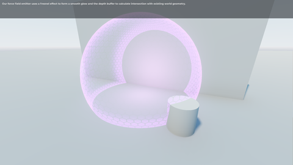 | **Force field** `ForceFieldDemo.tscn` | A fresnel effect forms the smooth glow, and the depth buffer finds where the field intersects existing world geometry. |
| 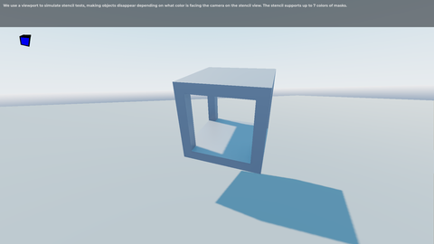 | **Impossible cube (stencil mask)** `ImpossibleCubeDemo.tscn` | A viewport simulates stencil tests, making objects disappear depending on which colour faces the camera in the stencil view. The stencil supports up to 7 colours of masks. |
| 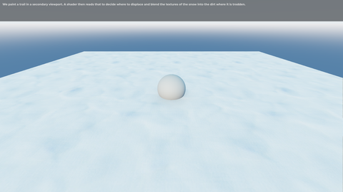 | **Interactive snow** `InteractiveSnowDemo.tscn` | A trail is painted into a secondary viewport. A shader reads it to decide where to displace the snow and blend it into the dirt underneath. |
| 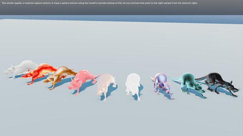 | **MatCap** `MatCapDemo.tscn` | This shader applies a material capture texture. It maps a sphere texture using the model's normals instead of UVs. So any normals that point to the right sample from the texture's right. |
| 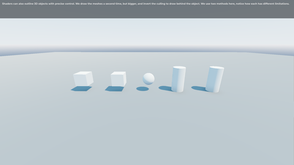 | **3D outline** `Outline3DDemo.tscn` | Outlines 3D objects with precise control. The meshes are drawn a second time, larger, with inverted culling so the copy sits behind the object. Two methods are shown; each has different limitations. |
| 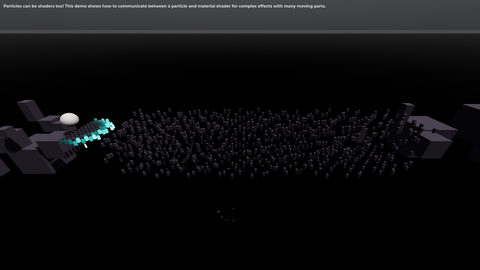 | **Particle bridge** `ParticleBridgeDemo.tscn` | Particles can be shaders too! This demo shows how to communicate between a particle and material shader for complex effects with many moving parts. |
| 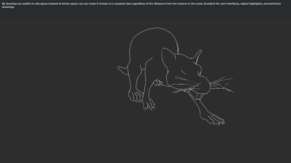 | **Pixel-perfect 3D outline** `PixelPerfectOutline3DDemo.tscn` | Drawing the outline in clip space instead of vertex space keeps it a constant width regardless of distance from the camera or object scale. Suited to user interfaces, object highlights and technical drawings. |
| 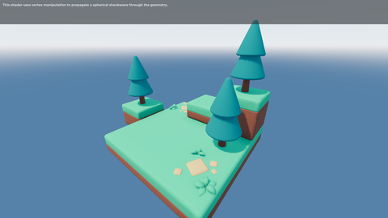 | **3D shockwave** `Shockwave3DDemo.tscn` | This shader uses vertex manipulation to propagate a spherical shockwave through the geometry. |
| 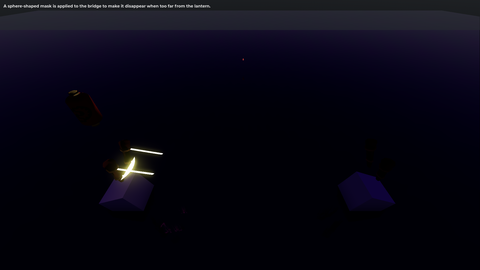 | **Spherical mask** `SphereMaskDemo.tscn` | A sphere-shaped mask is applied to the bridge to make it disappear when too far from the lantern. |
| 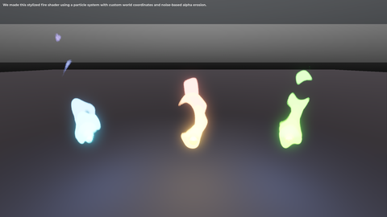 | **Stylized fire** `StylizedFireDemo.tscn` | A particle system with custom world coordinates and noise-based alpha erosion. |
| 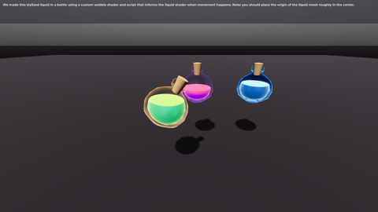 | **Stylized bottled liquid** `StylizedLiquidDemo.tscn` | A custom wobble shader, with a script that tells the liquid shader when movement happens. The liquid mesh's origin should sit roughly at its centre. |
| 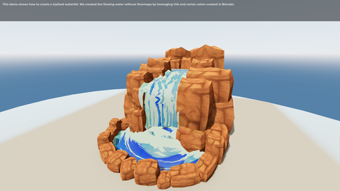 | **Stylized waterfall** `StylizedWaterfallDemo.tscn` | Flowing water built without flowmaps, using UVs and vertex colours authored in Blender. |
| 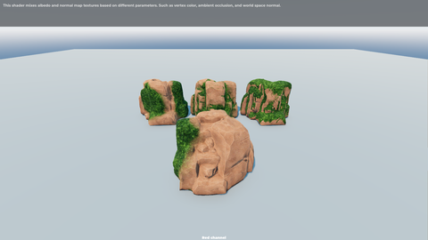 | **Texture mixing methods** `TextureMixDemo.tscn` | This shader mixes albedo and normal map textures based on different parameters. Such as vertex color, ambient occlusion, and world space normal. |
| 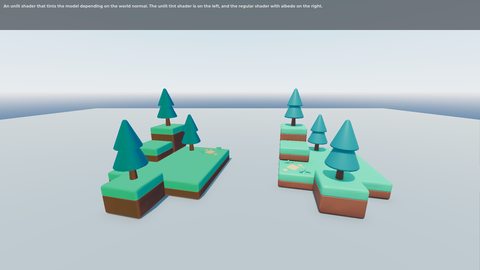 | **Unlit directional tint** `UnlitDirectionalTint.tscn` | An unlit shader that tints the model depending on the world normal. The unlit tint shader is on the left, and the regular shader with albedo on the right. |
| 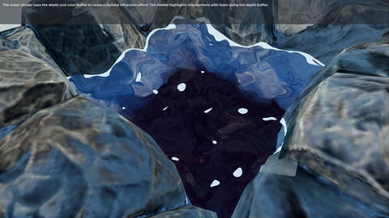 | **3D water** `Water3DDemo.tscn` | The water shader uses the depth and color buffer to cause a stylized refraction effect. The shader highlights intersections with foam using the depth buffer. |
| 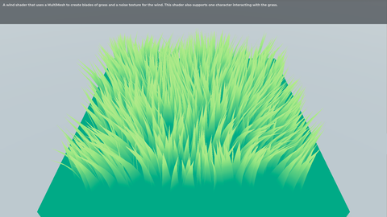 | **Wind grass** `WindGrassDemo.tscn` | A wind shader that uses a MultiMesh to create blades of grass and a noise texture for the wind. This shader also supports one character interacting with the grass. |
| 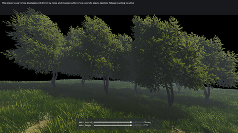 | **Wind trees** `WindTreesDemo.tscn` | This shader uses vertex displacement driven by noise and masked with vertex colors to create realistic foliage reacting to wind. |
| 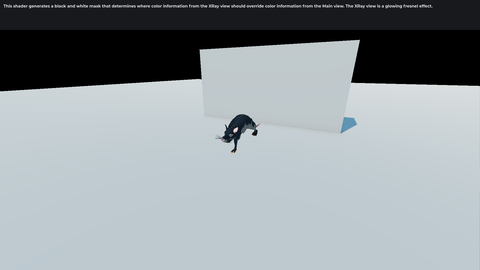 | **3D x-ray** `XRay3DDemo.tscn` | This shader generates a black and white mask that determines where color information from the XRay view should override color information from the Main view. The XRay view is a glowing fresnel effect. |

### 2D shaders

| | Demo | What it shows |
| --- | --- | --- |
| 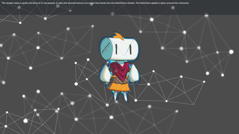 | **2D glow from a blur pass** `BlurGlowDemo.tscn` | The shader takes a sprite and blurs it in two passes. It uses this blurred texture as a mask that feeds into the MainView's shader. The MainView applies a glow around the character. |
| 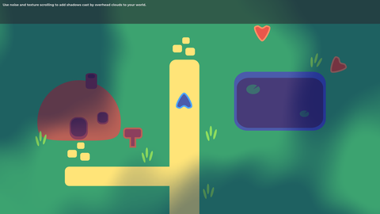 | **2D clouds** `Clouds2DDemo.tscn` | Use noise and texture scrolling to add shadows cast by overhead clouds to your world. |
| 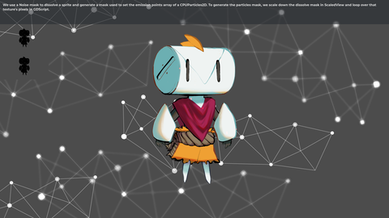 | **2D dissolve** `Dissolve2DDemo.tscn` | A noise mask dissolves the sprite and generates a second mask that fills the emission points array of a CPUParticles2D. The dissolve mask is scaled down in ScaledView, then its pixels are read in GDScript to build the particle mask. |
| 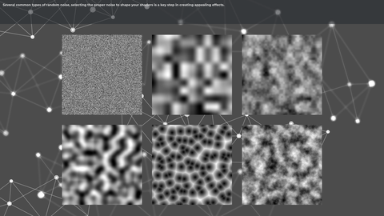 | **Noise types** `NoiseDemo.tscn` | Several common types of random noise, selecting the proper noise to shape your shaders is a key step in creating appealing effects. |
| 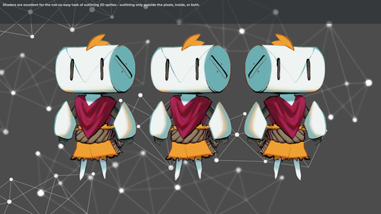 | **2D outline** `Outline2DDemo.tscn` | Shaders are excellent for the not-so-easy task of outlining 2D sprites - outlining only outside the pixels, inside, or both. |
| 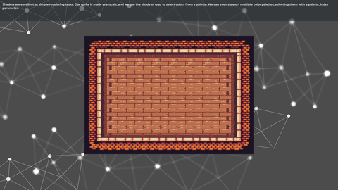 | **2D palette swap** `PaletteSwap2DDemo.tscn` | The sprite is made grayscale, and the shade of gray selects a colour from a palette. Multiple palettes are supported, selected with a `palette_index` parameter. |
| 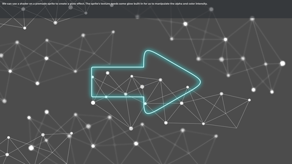 | **Baked-in-texture glow** `PreBakedGlowDemo.tscn` | A shader on a premade sprite creates a glow. The sprite's texture needs glow baked in for the shader to manipulate its alpha and colour intensity. |
| 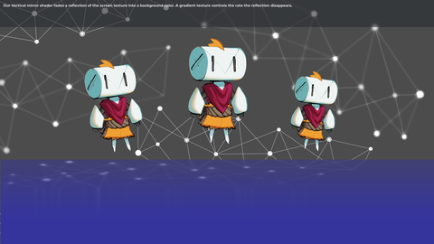 | **2D reflection (Sprite2D)** `Reflection2DDemo.tscn` | A vertical mirror shader fades a reflection of the screen texture into a background colour. A gradient texture controls how quickly the reflection disappears. |
| 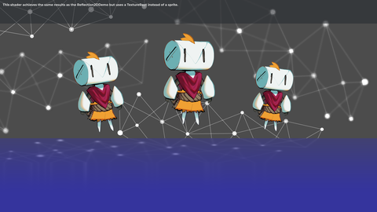 | **2D reflection (TextureRect)** `Reflection2DTextureRectDemo.tscn` | This shader achieves the same results as the Reflection2DDemo but uses a TextureRect instead of a sprite. |
| 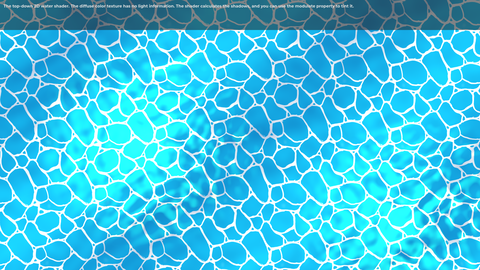 | **Top-down 2D water** `Water2DDemo.tscn` | The top-down 2D water shader. The diffuse color texture has no light information. The shader calculates the shadows, and you can use the modulate property to tint it. |
| 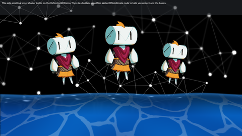 | **Side-scrolling 2D water** `WaterSidescroll2DDemo.tscn` | This side-scrolling water shader builds on the Reflection2DDemo. There is a hidden, simplified Water2DSideSimple node to help you understand the basics. |
| 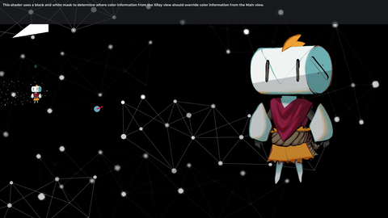 | **2D x-ray** `XRay2DDemo.tscn` | This shader uses a black and white mask to determine where color information from the XRay view should override color information from the Main view. |

### Screen and viewport effects

| | Demo | What it shows |
| --- | --- | --- |
| 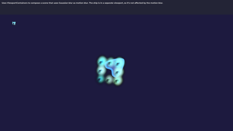 | **Motion blur with SubViewportContainers** `BlurViewportContainersDemo.tscn` | Uses ViewportContainers to compose a scene that uses Gaussian blur as motion blur. The ship is in a separate viewport, so it's not affected by the motion blur. |
| 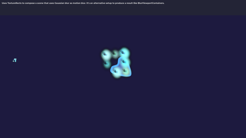 | **Motion blur with TextureRects** `BlurViewportTexturesDemo.tscn` | Uses TextureRects to compose a scene that uses Gaussian blur as motion blur. It's an alternative setup to produce a result like BlurViewportContainers. |
| 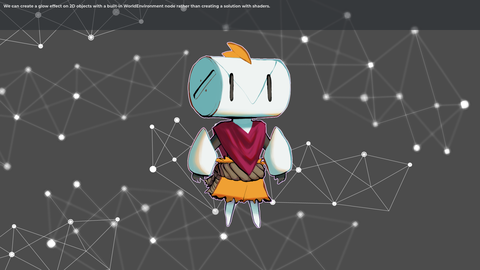 | **Glow from a WorldEnvironment** `EnvironmentGlowDemo.tscn` | Glow on 2D objects from a built-in WorldEnvironment node, without writing a shader for it. |
| 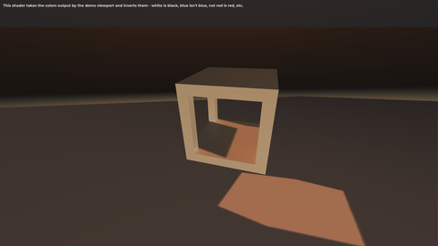 | **Inverted colours** `InvertedColorsDemo.tscn` | This shader takes the colors output by the demo viewport and inverts them - white is black, blue isn't blue, not red is red, etc. |
| 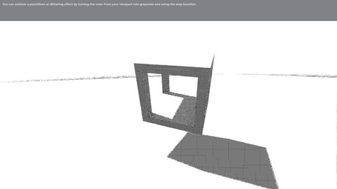 | **Pointilism** `PointilismDemo.tscn` | You can achieve a pointillism or dithering effect by turning the color from your viewport into grayscale and using the step function. |
| 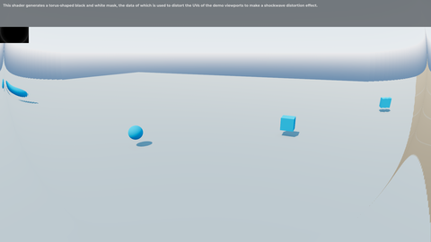 | **Screen distortion (2D shockwave)** `ShockwaveDemo.tscn` | This shader generates a torus-shaped black and white mask, the data of which is used to distort the UVs of the demo viewports to make a shockwave distortion effect. |
## Contributing

Found a bug, or want to add a shader?
[Open an issue](https://github.com/keshon/godot-shaders/issues/new).

Run [the checks](godot/tests/README.md) before opening a pull request. A new
demo dropped into `Demos/` is picked up by them automatically.

Code follows GDQuest's [GDScript style
guide](https://www.gdquest.com/docs/guidelines/best-practices/godot-gdscript/),
which the existing sources were written against.

## Credits

The shaders and demos are the work of [GDQuest](https://www.gdquest.com/) and
its contributors, made for the Godot Shader Secrets course. This fork only
ports them.

Stylized fire adapted from a Unity tutorial by
[@minionsart](https://twitter.com/minionsart/).

Licensed under the terms in [LICENSE](LICENSE).
